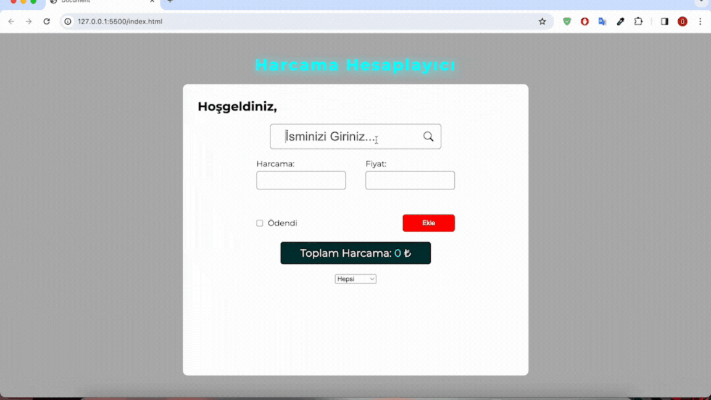

<h1>Expense Calculator</h1>

Bu bir harcama hesaplayıcı olarak tasarlanmıştır. Girdiğimiz isimlere ait harcamalar localstorage'de saklanarak takip etmek için depolanmaktadır. Depolama yapılırken uygulamayı kullanan kişi için ayrı ayrı depolama yapılmaktadır ve her kullanıcı kendi hesaplarını takip edebilmektedir.

<h2>Kullanılan Diller</h2>

Bu projede HTML, CSS ve JavaScrip kullanılmıştır

<h2>Ekran Videosu</h2>

